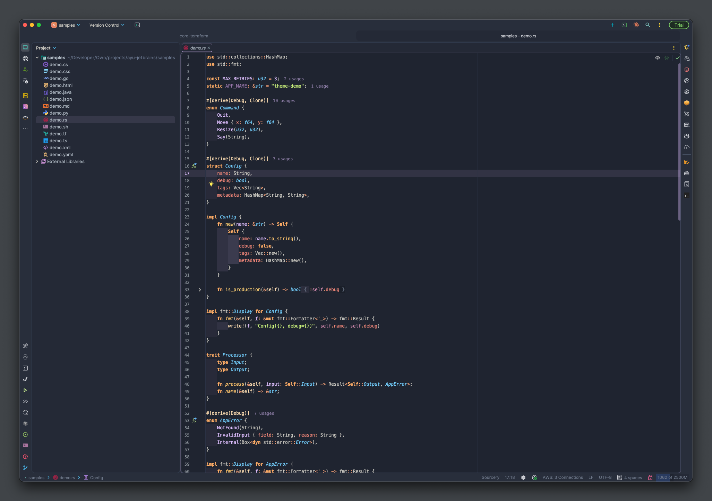
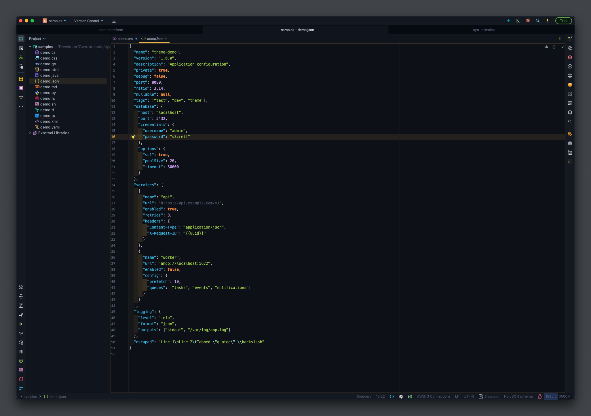
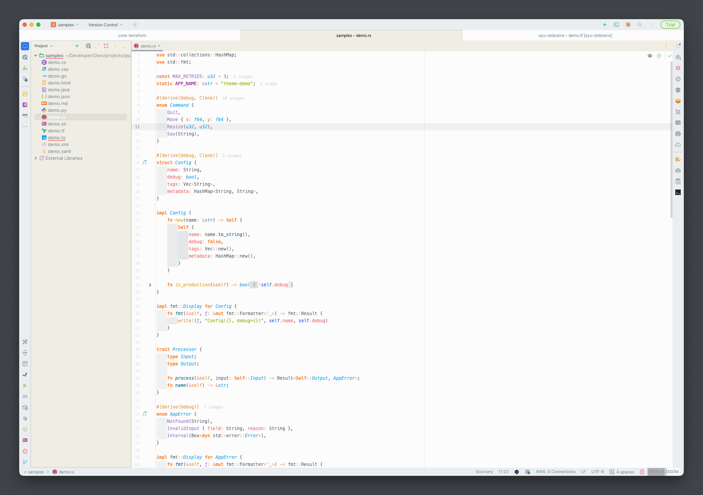

<p align="center">
  
</p>

<p align="center">
  Warm, refined color themes for JetBrains IDEs — three Ayu palettes with modern Islands UI.
</p>

<!-- Replace PLUGIN_ID below with the numeric ID from JetBrains Marketplace once published -->

<p align="center">
  <a href="https://github.com/barad1tos/ayu-jetbrains/actions/workflows/build.yml">
    
  </a>
  <a href="https://plugins.jetbrains.com/plugin/PLUGIN_ID-ayu-islands">
    
  </a>
  <a href="https://plugins.jetbrains.com/plugin/PLUGIN_ID-ayu-islands">
    
  </a>
  <a href="LICENSE">
    
  </a>
</p>

---

## Preview

<!-- Add screenshots after installing the themes in an IDE -->

<details open>
<summary><strong>Mirage</strong> — warm blue-gray</summary>
<br>

</details>

<details>
<summary><strong>Dark</strong> — deep midnight</summary>
<br>

</details>

<details>
<summary><strong>Light</strong> — warm daylight</summary>
<br>

</details>

## Palettes

Each variant uses canonical colors from [ayu-colors](https://github.com/ayu-theme/ayu-colors).

| | Background | Foreground | Accent | Keyword | String | Entity |
|---|---|---|---|---|---|---|
| **Mirage** | `#1F2430` | `#CCCAC2` | `#FFCC66` | `#FFAD66` | `#D5FF80` | `#73D0FF` |
| **Dark** | `#0D1017` | `#BFBDB6` | `#E6B450` | `#FF8F40` | `#AAD94C` | `#59C2FF` |
| **Light** | `#FAFAFA` | `#5C6166` | `#F29718` | `#FA8532` | `#86B300` | `#22A4E6` |

## Features

- **6 themes** — Mirage, Dark, and Light, each in classic and Islands UI variants
- **Islands UI** — rounded panels, island gaps, and compact mode support
- **20+ language-specific highlights** — carefully tuned per-language tokens, not just defaults
- **Canonical ayu-colors** — syntax palettes from [ayu-theme/ayu-colors](https://github.com/ayu-theme/ayu-colors)
- **Full VCS integration** — diff gutters, file status colors, merge indicators, blame annotations
- **16-color terminal palette** — per-variant terminal colors that feel native
- **Project color gradients** — 9 color groups in Ayu hues
- **Verified on 12 IDEs** — IntelliJ IDEA, PyCharm, WebStorm, GoLand, RustRover, Rider, PhpStorm, CLion, DataGrip, RubyMine, and more

## Installation

### From JetBrains Marketplace

**Settings** → **Plugins** → **Marketplace** → search **"Ayu Islands"** → **Install**

Then activate: **Settings** → **Appearance & Behavior** → **Appearance** → **Theme** → pick your variant.

### Manual

1. Download the `.zip` from [Releases](https://github.com/barad1tos/ayu-jetbrains/releases)
2. **Settings** → **Plugins** → **⚙** → **Install Plugin from Disk...**
3. Select the downloaded `.zip` and restart the IDE

## Supported Languages

Ayu Islands provides hand-tuned syntax highlighting for:

| Languages | |
|---|---|
| Java, Kotlin, Scala | C#/.NET (Rider/ReSharper) |
| Rust | Go |
| Python | JavaScript / TypeScript |
| HCL / Terraform | Dart |
| HTML, CSS, XML | SQL |
| Ruby | PHP |
| Bash / Shell | YAML, JSON, TOML |
| Markdown | Regular Expressions |

Languages without explicit overrides inherit from `DEFAULT_*` attributes, which are also themed — so every language benefits from the Ayu palette.

## Building from Source

```bash
# Build the distribution ZIP
./gradlew buildPlugin

# Launch a sandboxed IDE with the plugin loaded
./gradlew runIde

# Verify against 12 IDE targets
./gradlew verifyPlugin
```

Output: `build/distributions/ayu-jetbrains-<version>.zip`

## Contributing

Contributions are welcome! Whether it's a bug report, a new language highlight, or a color tweak — open an [issue](https://github.com/barad1tos/ayu-jetbrains/issues) or submit a pull request.

See [CHANGELOG.md](CHANGELOG.md) for the release history.

## Credits

- Color palettes from [ayu-theme/ayu-colors](https://github.com/ayu-theme/ayu-colors) by Ike Ku
- Built on the [IntelliJ Platform](https://plugins.jetbrains.com/docs/intellij/welcome.html) by JetBrains

## License

[BSL-1.1](LICENSE) — source-available, converts to [Apache 2.0](https://www.apache.org/licenses/LICENSE-2.0) on 2030-02-24.
