<p align="center">
  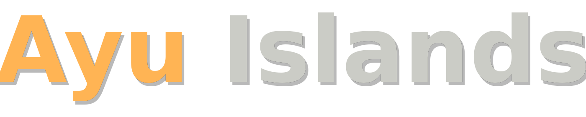
</p>

<p align="center">
  <strong>Not another color swap</strong> — a unified aesthetic engine for every JetBrains IDE.
</p>

<p align="center">
  <a href="https://plugins.jetbrains.com/plugin/30373-ayu-islands">
    
  </a>
</p>

<p align="center">
  <a href="https://github.com/barad1tos/ayu-jetbrains/actions/workflows/build.yml">
    
  </a>
  <a href="https://codecov.io/gh/barad1tos/ayu-jetbrains">
    
  </a>
  <a href="https://plugins.jetbrains.com/plugin/30373-ayu-islands">
    
  </a>
  <a href="https://plugins.jetbrains.com/plugin/30373-ayu-islands">
    
  </a>
  <a href="LICENSE">
    
  </a>
</p>

<br>

<p align="center">
  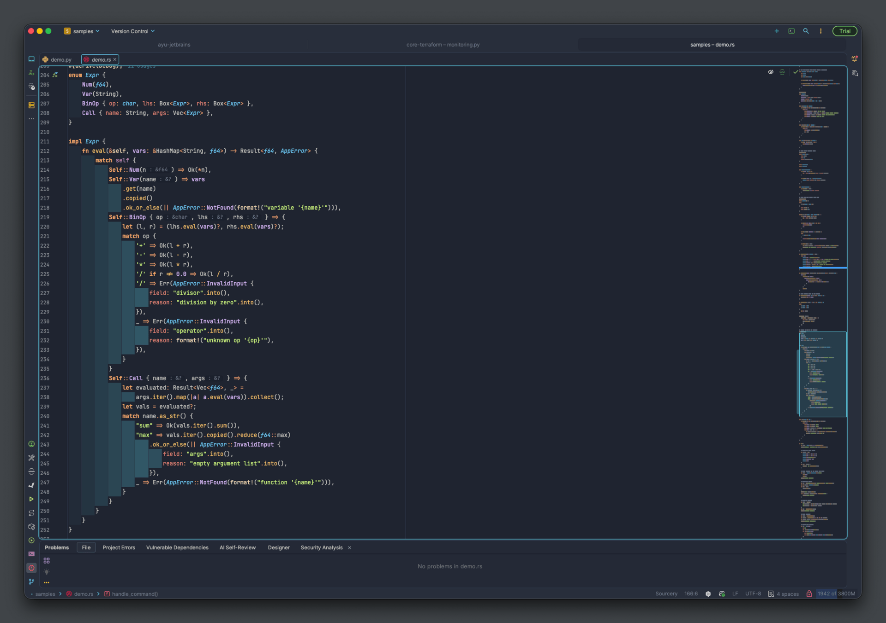
</p>

---

Ayu Islands synchronizes palette, font, glow, and accent color into a cohesive look — one click, entire mood shift. Built on [ayu-colors](https://github.com/ayu-theme/ayu-colors) (MIT) and **endorsed by [Ike Ku](https://github.com/dempfi)**, the original Ayu author, who called the project *"brilliant"* and invited it to [ayutheme.com](https://ayutheme.com).

> **30-day premium trial included.** All premium features unlocked on install, no credit card. The free tier is a complete theme — not a teaser.

## What sets it apart

- **Aesthetic engine, not a skin** — 500+ hand-tuned UI properties, 1,400+ editor attributes, and 5 settings tabs to shape how the IDE looks and feels
- **4 curated presets** — Whisper, Ambient, Neon, Cyberpunk — each synchronizes font, glow intensity, and indent colors into one cohesive mood
- **Plugin ecosystem** — accent color propagates into CodeGlance Pro and Indent Rainbow. As far as I know, no other JetBrains theme does this
- **Creator-endorsed** — the original Ayu author endorsed this project and invited it to the official Ayu site

## Premium — make the IDE feel yours

|                                                                                                                                                                                   |                                                                                                                                                                                                                                                                                                                                                                                                                                                                                                                                                                                                                                                    |
|-----------------------------------------------------------------------------------------------------------------------------------------------------------------------------------|----------------------------------------------------------------------------------------------------------------------------------------------------------------------------------------------------------------------------------------------------------------------------------------------------------------------------------------------------------------------------------------------------------------------------------------------------------------------------------------------------------------------------------------------------------------------------------------------------------------------------------------------------|
| 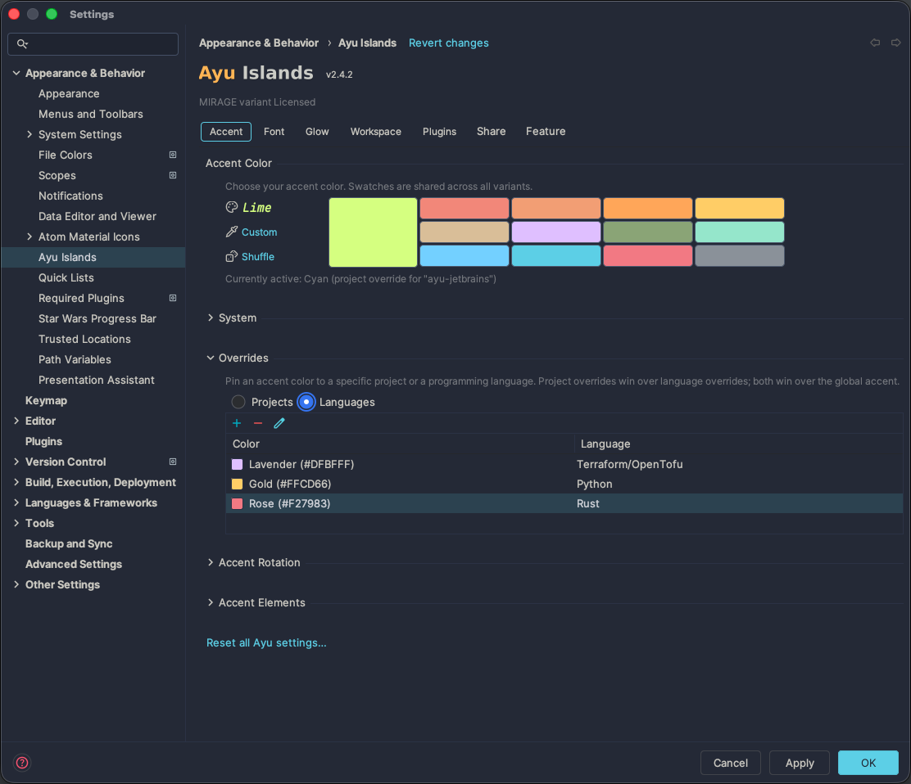<br>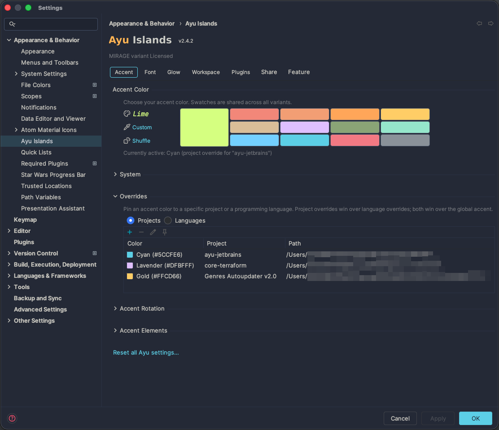 | **Accent control** — decide exactly where your accent color appears: scrollbars, links, caret line, search highlights, progress bars, bracket matches, inlay hints, tag matches. Eight independent switches. **Accent rotation** — automatic preset cycling or contrast-aware random. **Per-project** and **per-language** accent pins — bind a color to a specific project or language (Kotlin → cyan, Python → gold); the focus-swap kicks in instantly. Settings shows a live **language-proportions** breakdown of the current project so you know which pin will take effect, with a **Rescan Project Language** action to refresh on demand. |
| 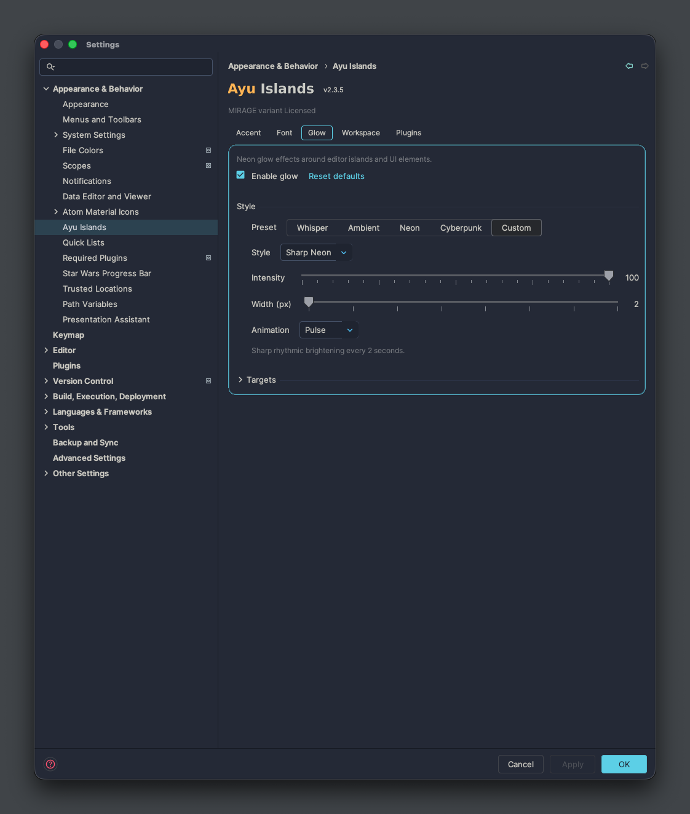                                                                                                                                         | **Glow** — a soft light beneath tabs and panels: Soft, Sharp Neon, or Gradient. Add Pulse, Breathe, or Reactive animation. Control intensity, width, and which of the 7 panels glow.                                                                                                                                                                                                                                                                                                                                                                                                                                                               |
| 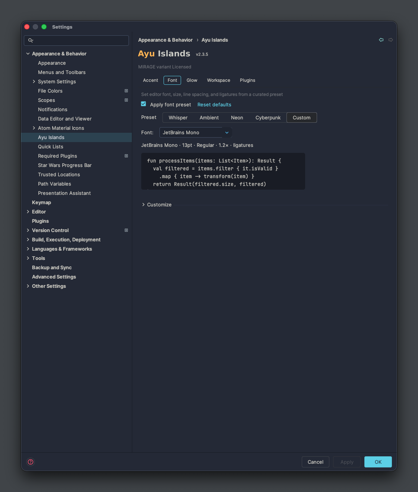                                                                                                                                          | **Font presets** — 4 curated Nerd Fonts (Whisper, Ambient, Neon, Cyberpunk) with one-click apply, live preview, and per-preset fine-tuning. **Install, delete, or reinstall fonts** directly from Settings with a consent dialog before any filesystem change.                                                                                                                                                                                                                                                                                                                                                                                     |
| 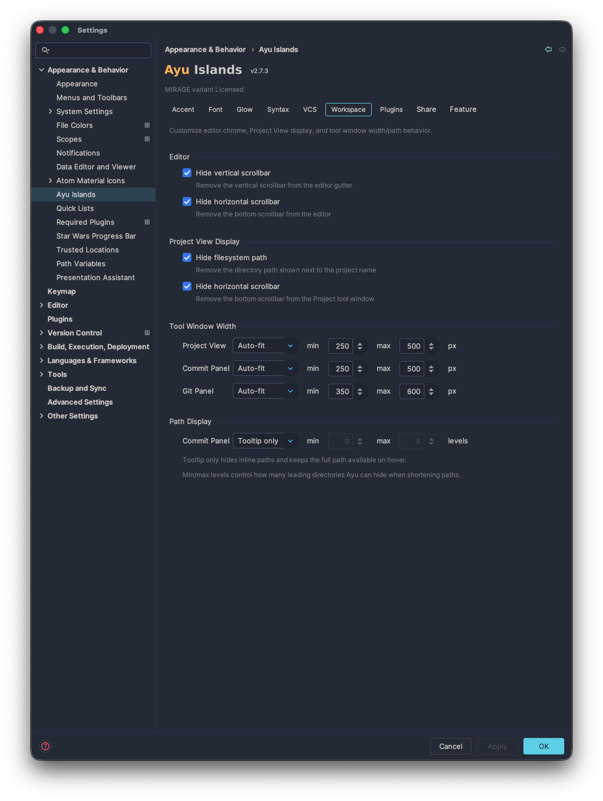                                                                                                                               | **Workspace** — auto-fit or fixed width for Project View, Commit, and Git panels with min/max bounds. **Git panel splitter** auto-resizes the branches and file-changes trees. Hide the filesystem path and scrollbar from Project View.                                                                                                                                                                                                                                                                                                                                                                                                           |
| 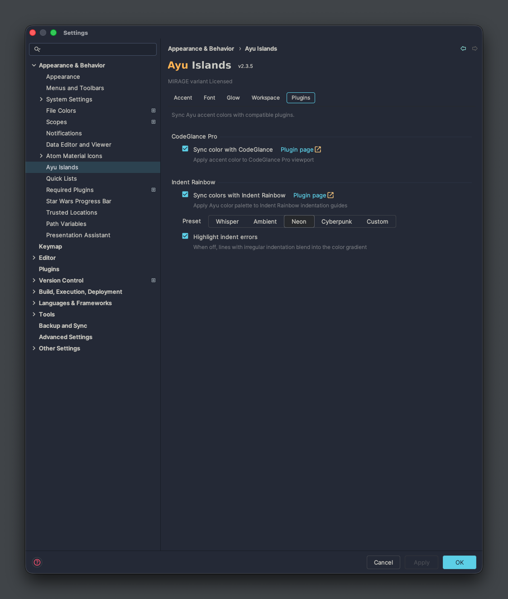                                                                                                                           | **Plugin sync** — accent into CodeGlance Pro minimap and Indent Rainbow guides. More integrations in development. **Bracket scope** — a colored gutter stripe showing the full scope on bracket hover.                                                                                                                                                                                                                                                                                                                                                                                                                                             |

**Tab styling** — Islands UI offers underline, full accent bar, or none; Classic UI has underline thickness from hairline to bold.

**Onboarding wizard** — a full-tab welcome opens on first install with preset cards, theme variant picker, and accent swatches. After upgrades, a **release showcase** tab opens automatically with captioned screenshots of the marquee features; reopen anytime via *Tools → Ayu Islands → Show What's New*.

## Free — a complete theme, not a teaser

6 theme variants (Mirage, Dark, Light — Classic & Islands UI). 40+ individually crafted language syntaxes. 12 accent presets + custom picker + macOS system sync. 4 font presets with one-click apply and live preview. Full VCS/diff colors and a 16-color terminal scheme. All free. No time limit. No feature degradation.

## Theme variants

<details open>
<summary><strong>Mirage</strong> — warm blue-gray</summary>
<br>
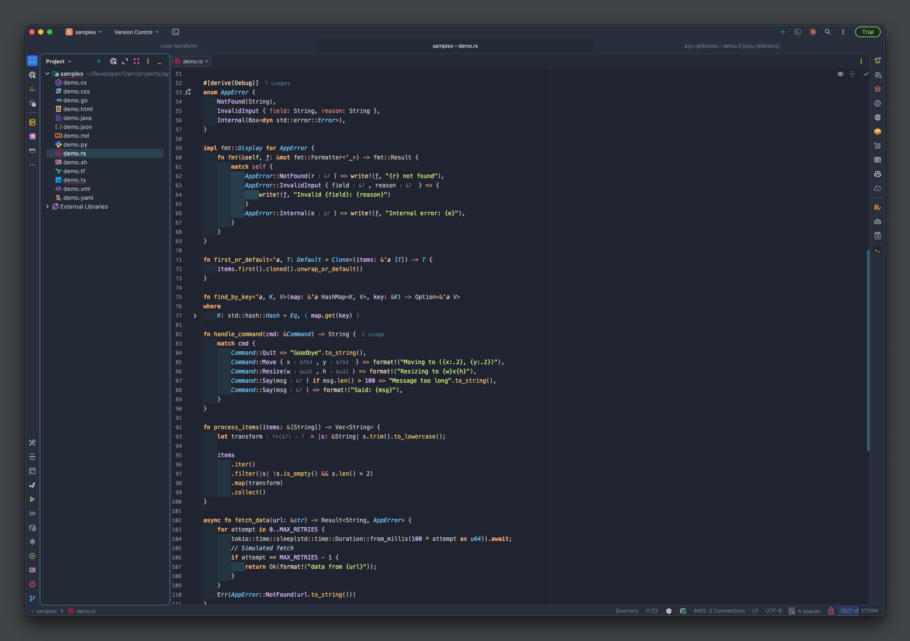
</details>

<details>
<summary><strong>Dark</strong> — deep midnight</summary>
<br>
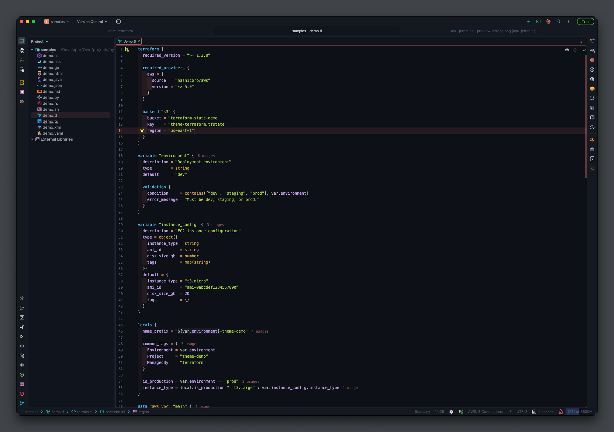
</details>

<details>
<summary><strong>Light</strong> — warm daylight</summary>
<br>
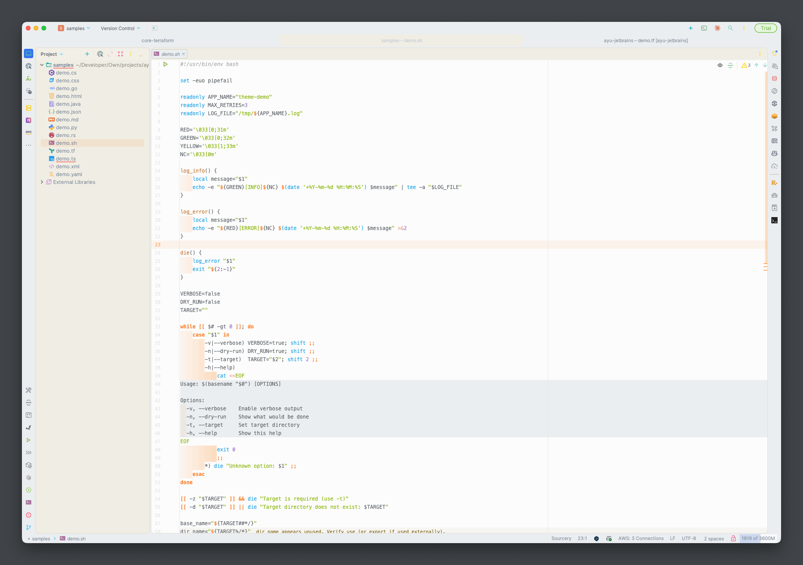
</details>

## Installation

### From JetBrains Marketplace

**Settings** → **Plugins** → **Marketplace** → search **"Ayu Islands"** → **Install**

Then activate: **Settings** → **Appearance & Behavior** → **Appearance** → **Theme** → pick your variant.

### Manual

1. Download the `.zip` from [Releases](https://github.com/barad1tos/ayu-jetbrains/releases/latest)
2. **Settings** → **Plugins** → **⚙** → **Install Plugin from Disk...**
3. Select the downloaded `.zip` and restart the IDE

## Supported languages

Ayu Islands provides hand-tuned syntax highlighting for 40+ languages and formats:

Java, Kotlin, Scala, C# / .NET (Rider / ReSharper), Swift, Rust, Go, Erlang, Lua, Python, Ruby, PHP, Dart, JavaScript / TypeScript, CoffeeScript, HTML, CSS, HAML, SLIM, JSP, Qute, Django Templates, GraphQL, JSON, XML, YAML, Properties, Puppet, Bash / Shell, Markdown, Regular Expressions, and more.

Languages without explicit overrides inherit from themed `DEFAULT_*` attributes — so every language benefits from the Ayu palette.

## Building from source

```bash
./gradlew buildPlugin        # Build the distribution ZIP
./gradlew runIde             # Launch a sandboxed IDE with the plugin
./gradlew verifyPlugin       # Verify against 12 IDE targets
```

Output: `build/distributions/ayu-jetbrains-<version>.zip`

See [CONTRIBUTING.md](CONTRIBUTING.md) for guidelines and [CHANGELOG.md](CHANGELOG.md) for the release history.

## Community

Got ideas, questions, or a setup you're proud of?

- [**Feature Requests**](https://github.com/barad1tos/ayu-jetbrains/discussions/categories/feature-requests) — suggest and vote on what's next
- [**Show Your Setup**](https://github.com/barad1tos/ayu-jetbrains/discussions/categories/show-your-setup) — share your config and screenshots
- [**Q&A**](https://github.com/barad1tos/ayu-jetbrains/discussions/categories/q-a) — ask anything about Ayu Islands

Found a bug? [Open an issue](https://github.com/barad1tos/ayu-jetbrains/issues/new?template=bug_report.yml) with our bug report template.

## Credits

- Built on [Ayu](https://ayutheme.com) by Ike Ku ([@dempfi](https://github.com/dempfi)) — color palettes from [ayu-theme/ayu-colors](https://github.com/ayu-theme/ayu-colors) (MIT)
- [IntelliJ Platform SDK](https://plugins.jetbrains.com/docs/intellij/welcome.html) by JetBrains

## License

[BSL-1.1](LICENSE) — source-available, converts to [Apache 2.0](https://www.apache.org/licenses/LICENSE-2.0) on 2030-02-24.
